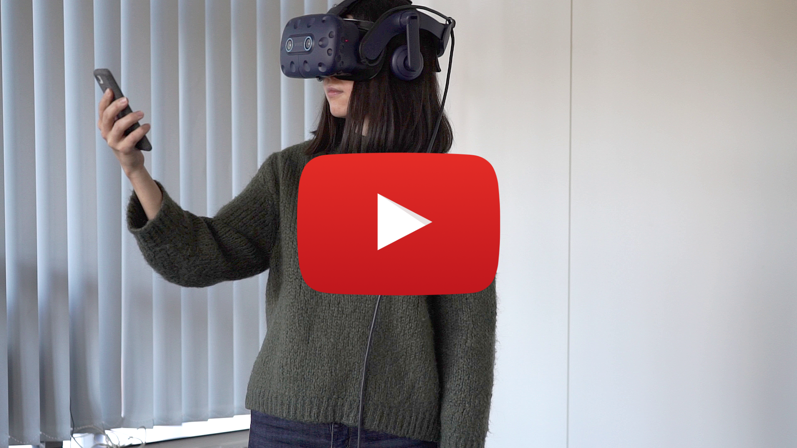

# VRySmart

The VRySmart framework aims to integrate smart devices into virtual environments. 

The project contains assets for both Windows and Android target platforms. The core of the framework is located under the Assets/Framework folder. The project integrates many different modules and at this point serves as a proof-of-concept or a starting point for further development.

For more details, please check out the CHI 2022 Late-Breaking Work below.

Link to the paper: [https://doi.org/10.1145/3491101.3519717](https://doi.org/10.1145/3491101.3519717)

Link to the presentation video [https://www.youtube.com/watch?v=qPkUWzpyVe8](https://www.youtube.com/watch?v=qPkUWzpyVe8)


[](http://www.youtube.com/watch?v=qPkUWzpyVe8 "VRySmart: a Framework for Embedding Smart Devices in Virtual Reality - Presentation")

## Requirements

The framework is built in Unity using SteamVR and SRWorks for skin segmentation.

Minimum requirements:
- (**Important!**) The framework relies on the OpenCVForUnity plugin for tracking Aruco markers. You can either purchase this asset [here](https://enoxsoftware.com/opencvforunity/), or use any other alternative for marker tracking.
- Unity 2019.4
- SteamVR
- SRWorks runtime

Hardware:
- HTC Vive Pro
- Smartphone (tested with Pixel 3)

### Packages:
- XR Plugin Management
- XR Interactin Toolkit
- Multiplayer HLAPI
- OpenVR (Desktop)
- Input System
- ViveSR

### Android support

#### Packages:
- AR Foundation
- ARCore Extensions
- ARCore XR Plugin

#### Project settings
Player -> Other Settings -> Active input handling -> Both 

## Usage

Main scene for the desktop app is: Desktop(OpenCVForUnity+RS+TS).unity

Main scene for the mobile app is: Mobile(RS+TS).unity

To test the scenarios:

1. Make sure you added OpenCVForUnity into the assets
2. Deploy the mobile app to your smartphone
3. If you want to use Camera streaming start webserver.exe - Shortcut from the root folder
4. Start Windows app
5. Start Android app
6. Android app requests host-ip address. Provide the ip-address of the PC where the main VR-app is running and press connect

## Scenarios

Currently, four different scenarios are implemented.


## Troubleshooting

### Mobile app doesn't connect to the VR-host
Check firewall settings on the PC, it might block the connection

### Checkout Issues

Please ensure that you have activated git LFS to checkout this repo.
If you receive a smudge error, please refer here: [Smudge Error while downloading repo](https://stackoverflow.com/questions/46521122/smudge-error-error-downloading)

### Camera stream is white
Check Firewall settings, consider disabling it for the private network

### Compliation conflicts for Android if deprecated scripts ViveSR_StaticColliderPool.cs, ViveSR_StaticColliderInfo.cs from ViveSR package are part of the project
Remove the scripts

## Paper

The VRySmart framework originated from a Masters thesis at the Saarland University by Akhmajon Makhsadov.
This project was published at the [ACM CHI'22 conference](https://chi2022.acm.org/) as a Late-Breaking Work.
DOI: [https://doi.org/10.1145/3491101.3519717](https://doi.org/10.1145/3491101.3519717)


> **VRySmart: a Framework for Embedding Smart Devices in Virtual Reality**
>
> **Authors:** Akhmajon Makhsadov, Donald Degraen, André Zenner, Felix Kosmalla, Kamila Mushkina, Antonio Krüger
>
> **Abstract:**
> As immersive virtual experiences find their way into our living room entertainment, they are becoming part of our daily technological consumption. However, state-of-the-art virtual reality (VR) remains disconnected from other digital devices in our environment, such as smartphones or tablets. As context switches between acting in the virtual environment and resolving external notifications negatively influence immersion, we look towards integrating smart devices into virtual experiences.
To this aim, we present the VRySmart framework. Through either optical marker tracking or simultaneous localization and mapping (SLAM), embedded smart devices can be used as VR controllers with different levels of integration while their content is incorporated into the virtual context to support the plausibility of the illusion. To investigate user impressions, we conducted a study (N = 10) where participants used a smartphone in four different virtual scenarios. Participants positively assessed smart device usage in VR. We conclude by framing implications for future work.


## Citation

If you want to reference our work, please use the following bibtex entry:

```
@inproceedings{makhsadov2022vrysmart,
  author={Makhsadov, Akhmajon and Degraen, Donald and Zenner, Andr\'{e} and Kosmalla, Felix and Mushkina, Kamila and Kr\"{u}ger, Antonio},
  title={VRySmart: a Framework for Embedding Smart Devices in Virtual Reality},
  year={2022},
  isbn = {},
  publisher = {Association for Computing Machinery},
  address = {New York, NY, USA},
  url = {https://doi.org/10.1145/3491101.3519717},
  doi = {10.1145/3491101.3519717},
  booktitle = {Extended Abstracts of the 2022 CHI Conference on Human Factors in Computing Systems},
  pages = {},
  numpages = {},
  keywords = {smart devices, virtual reality, haptic feedback, framework},
  location = {New Orleans, LA, USA},
  series = {CHI '22}
}
```

## License

(c) Copyright 2022 of the respective paper authors. For inquiries, please contact Donald Degraen (donald.degraen-at-gmail.com).

This software is made available under the terms of the [GNU Affero General Public License](https://www.gnu.org/licenses/agpl-3.0.html) as published by the Free Software Foundation, either version 3 of the License, or (at your option) any later version.

This program is distributed in the hope that it will be useful, but WITHOUT ANY WARRANTY; without even the implied warranty of MERCHANTABILITY or FITNESS FOR A PARTICULAR PURPOSE. See the GNU Affero General Public License for more details.

## Attributions
https://sketchfab.com/3d-models/lightsaber-starwarshype-0dff87970ba44138982fcb132d3e667d

https://freesound.org/people/joe93barlow/sounds/78674/

https://freesound.org/people/gyzhor/sounds/47127/
